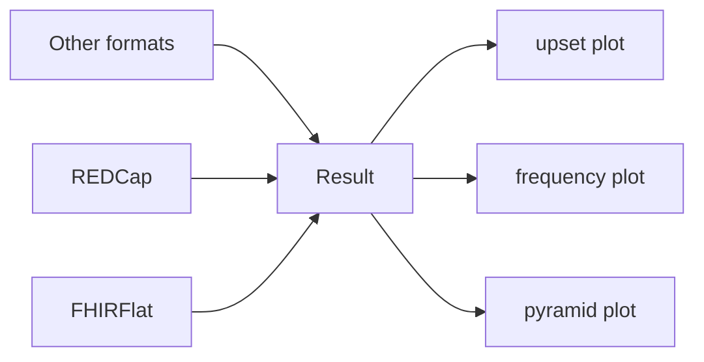

# FHIRFLAME

FHIR FLexible Analytics and Modelling Engine

This package is part of the Global.health-ISARIC pipeline.

## Context and Problem

Data processing and transformation (ETL) is done by the
[FHIRFlat](https://fhirflat.readthedocs.io) library. Once input data is brought
into FHIRFlat, it is represented as a (optionally zipped) folder of FHIR
resources, with a parquet file corresponding to each resource:
`patient.parquet`, `encounter.parquet` and so on.

Once the data is in FHIRFlat, we need a easy to use library that can be used by
itself, and as a building block for visualizations such as
[VERTEX](https://vertex-isaric.replit.app).

**Output**: A easy to use library that can be used in Jupyter notebooks and
other downstream code to allow querying answers to [common research
questions](../1.01_ISARIC3/README.md#research-questions).

**Non-goals**: Allow answering arbitrary questions. FHIRFlat uses open formats
(parquet) that users can query directly using tools such as pandas or the R
[{arrow}](https://arrow.apache.org/docs/1.0/r/) package, and FHIRFLAME allows
flexibility in dataframe type as long as the dataframe schema required patterns
for plot types (e.g. age pyramid plot should have a numeric age column).

## Installing

You can install FHIRFLAME from GitHub

```shell
pip install git+https://github.com/globaldothealth/FHIRFLAME
```

## Capabilities

### Generic base for building RAP

FHIRFLAME is a generic library for plots and standard analyses that will
be used as a basis for constructing visualizations that work with
clinical data. The library can generate plots and undertake analyses
based on a general *dataframe schema* (column names and types).



Higher level modules in the form of data standard specific extensions
produce a `Result` object. Higher level modules do not know about the
particulars of how a plot or analysis is performed. Their only function
is to construct the `Result` object with a dataframe that conforms to the
schema required by the result type. An example `Result` construction
could be like:

```python
>>> Result(df, ResultType.Upset)
```
which indicates to the underlying plotting and analysis module that the
dataframe `df` is in a format that is acceptable to construct a UpSet
plot from. A `Result` can have multiple 'outputs':
```python
>>> Result(df, [ResultType.Upset, ResultType.Passthrough])
```
with the `Passthrough` ResultType does not alter the dataframe
and is the simplest ResultType.

Usually the higher level module should construct the dataframe to be
exactly of the type the appropriate ResultType expects, without which a
`ResultTypeError` is raised. However in cases where that is not
possible, one can use the `mapColumns()` function to alter the Result
object so that the columns match:

```python
>>> Result(df, ResultType.Upset).mapColumns(col="coding.code")
```
where ResultType.Upset expects a column named `col`.

Any `Result` object can be saved using the `Result.save()` function
which will export dataframes as CSV and plots as png.

### Data standard specific extensions

Work with datasets with a `FHIRFlatData` object. Loading the dataset
automatically verifies checksums, to ensure integrity of data sources
and follow RAP best practices:

```python
>>> from fhirflame.flat import FHIRFlatData
# Data is always loaded with a checksum for reproducibility
>>> data = FHIRFlatData('dengue', checksum="55d0b2642ede06e4d1e0137f85f0536a3256895c22b5e96c89bf923e7328606e")  # loads data from dengue folder
>>> data.N
458245
>>> data.description
'Dengue data from Brazil'
>>> data.patient
<patient dataframe>
```

Once the dataset is loaded, it can be passed to analysis functions. Checksums of the source data should be passed through to the Result
object if possible.

```python
>>> from fhirflame.flat import upset_plot, snomed
>>> plot1 = upset_plot(data.condition, data.terms.adsym_headache + data.terms.adsym_vomit)
<Result N=20 ResultType.Upset source=/home/work/sample checksum=9238498>
>>> plot1.show()
>>> plot1.data  # gets underlying data
```

Similar functions:

- `freq_yn_plot_code(data, <table>, <list of codes>)` that does plots such as
  frequency of signs and symptoms on presentation
- `count_code(data, <table>, <list of codes>)` creates frequency counts
- `age_pyramid(data)` returns a age pyramid

## UX issues

How do we ensure codes are easy to use? Should we distribute standardised code lists with human readable mappings?

One proposal is to include list of terms in the fhirflat.ini file. This
list SHOULD be mostly auto-generated from the mapping file, and would
allow each dataset to carry its own terminology with it. The terminology
would then be available from analysis scripts. In most ISARIC datasets,
the terminology used will be the same as ARC, which is accessible in the
mapping file in `raw_variable`.

This could be done through scoped enums where the terminology is
converted into Pythonic names separated by underscores:

```python
from enum import Enum
from argparse import Namespace
def f():
    T = Namespace()
    T.Condition =  Enum('Condition', {
        "present": "https://snomed.info/sct|373066003",
        "absent": "https://snomed.info/sct|373067005",
    })
    T.demog_occupation = Enum('demog_occupation', {"Home_working_or_unemployed": "http://snomed.info/sct|14679004"})
    return T

T = f()
```

Then terms can be accessed via dot-notation, and also accessible via
autocomplete in Jupyter Lab / Jupyter notebook / IDEs:

```python
>>> T.demog_occupation.Home_working_or_unemployed
<demog_occupation.Home_working_or_unemployed: 'http://snomed.info/sct|14679004'>
```
