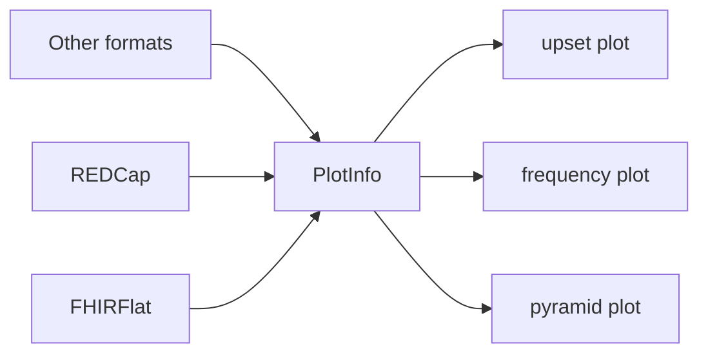

# PolyFLAME

Polymorphic FLexible Analytics and Modelling Engine

This package is part of the Global.health-ISARIC pipeline.

## Context and Problem

Data processing and transformation (ETL) is done by the
[FHIRFlat](https://fhirflat.readthedocs.io) library. Once input data is brought
into FHIRFlat, it is represented as a (optionally zipped) folder of FHIR
resources, with a parquet file corresponding to each resource:
`patient.parquet`, `encounter.parquet` and so on.

Once the data is in FHIRFlat, we need a easy to use library that can be used by
itself, and as a building block for visualizations such as
[VERTEX](https://vertex-isaric.replit.app).

**Output**: A easy to use library that can be used in Jupyter notebooks and
other downstream code to allow querying answers to [common research
questions](../1.01_ISARIC3/README.md#research-questions).

**Non-goals**: Allow answering arbitrary questions. FHIRFlat uses open formats
(parquet) that users can query directly using tools such as pandas or the R
[{arrow}](https://arrow.apache.org/docs/1.0/r/) package, and FHIRFLAME allows
flexibility in dataframe type as long as the dataframe schema required patterns
for plot types (e.g. age pyramid plot should have a numeric age column).

## Installing

You can install PolyFLAME from GitHub

```shell
pip install git+https://github.com/globaldothealth/polyflame
```

## Capabilities

### Generic base for building RAP

PolyFLAME is a generic library for plots and standard analyses that will
be used as a basis for constructing visualizations that work with
clinical data. The library can generate plots and undertake analyses
based on a general *dataframe schema* (column names and types).



Higher level modules in the form of data standard specific extensions
produce a dataframe. Higher level modules do not know
about the particulars of how a plot or analysis is performed. There is
a generic `plot()` function which can plot any data as long as it
is of the correct 'shape':

```python
# Example of a dataframe that can be used in a proportion plot
>>> df = pd.DataFrame({'condition': ['diabetes', 'lung disease'], 'fraction': [0.8, 0.2]})
>>> plot(df, "proportion", cols={"label": "condition", "proportion": "fraction"})
```
which indicates to the underlying plotting and analysis module that the
dataframe `df` is in a format that is acceptable to construct a proportion
plot from. A proportion plot requires mapping to 'label' and 'proportion'
columns (if they are not present) which is specified in the `cols` parameter.

### Data standard specific extensions

Extensions are coded as submodules of the main `polyflame` library, such as
`polyflame.fhirflat` to read FHIRFlat data

```python
>>> from polyflame import load_data
>>> from polyflame.fhirflat import case_hospitalisation_rate, condition_proportions
# Data is always loaded with a checksum for reproducibility
>>> data = load_data('dengue', checksum="55d0b2642ede06e4d1e0137f85f0536a3256895c22b5e96c89bf923e7328606e")  # loads data from dengue folder
>>> data
{
  'N': 458245,
  'id': 'dengue-brazil-data'
  'path': '/Users/example/data/dengue'
  'checksum': '55d0b2642ede06e4d1e0137f85f0536a3256895c22b5e96c89bf923e7328606e'
}
>>> polyflame.fhirflat.case_hospitalization_rate(data)
{
  'mean': 13
  'lower_bound': 5
  'upper_bound': 18
}
>>> plot(condition_proportions(data, ["https://snomed.info/sct|2938499", "https://snomed.info/sct|1025273"]), "proportion")
[plot shown]
```

## UX issues

How do we ensure codes are easy to use? Should we distribute standardised code lists with human readable mappings?

One proposal is to include list of terms in the fhirflat.ini file. This
list SHOULD be mostly auto-generated from the mapping file, and would
allow each dataset to carry its own terminology with it. The terminology
would then be available from analysis scripts. In most ISARIC datasets,
the terminology used will be the same as ARC, which is accessible in the
mapping file in `raw_variable`.

This could be done through scoped enums where the terminology is
converted into Pythonic names separated by underscores:

```python
from enum import Enum
from argparse import Namespace
def f():
    T = Namespace()
    T.Condition =  Enum('Condition', {
        "present": "https://snomed.info/sct|373066003",
        "absent": "https://snomed.info/sct|373067005",
    })
    T.demog_occupation = Enum('demog_occupation', {"Home_working_or_unemployed": "http://snomed.info/sct|14679004"})
    return T

T = f()
```

Then terms can be accessed via dot-notation, and also accessible via
autocomplete in Jupyter Lab / Jupyter notebook / IDEs:

```python
>>> T.demog_occupation.Home_working_or_unemployed
<demog_occupation.Home_working_or_unemployed: 'http://snomed.info/sct|14679004'>
```
